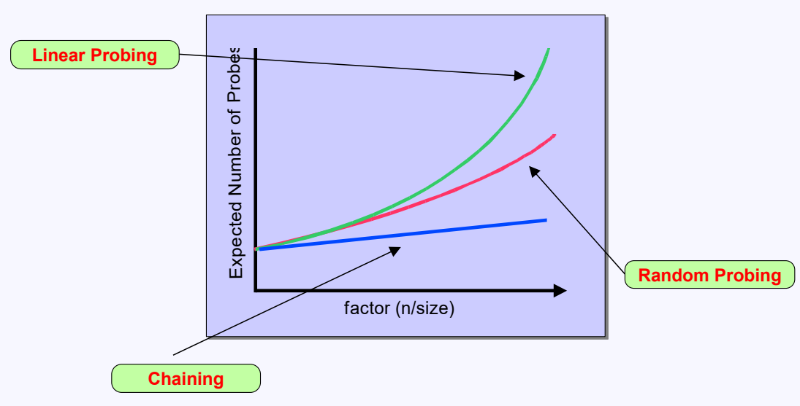

# Hash Table

## Introduction

- Hash table is a data structure that stores key-value pairs.
- Supports fast lookups in near constant time.
- Uses a hash function to compute key into an index for an array, Which is internally used to store the data.

## Direct Address Table

- **Hash Function**: $h(k) = k$
- **Time Complexity**:
    - Insert: O(1)
    - get: O(1)
    - Delete: O(1)
- Internal array is a simple array that stores the value only.
- One-to-one mapping between key and index. **No collision.**
- Feasible only when the range of keys is small.
- The table size is equal to the range of keys.

```cpp
class DirectAddressTable {
private:
    vector<int> table;
public:
    DirectAddressTable(int size) {
        table.resize(size, -1);
    }

    void put(int key, int value) {
        table[key] = value;
    }

    int get(int key) {
        return table[key];
    }

    void remove(int key) {
        table[key] = -1;
    }
};
```

## Collision Handling

- **Collision**: Two keys hash to the same index.
- **Chaining**: Each slot of the hash table is a linked list.
- **Open Addressing**: All elements are stored in the hash table itself.
- **Rehashing**: Create a new hash table with a larger size and move all the elements.

### Chaining

- Handle collisions by changing the internal array to an array of linked lists.
- Linked list nodes contain the key and the value.

```cpp
struct Node {
    int key, value;
    Node* next;
    Node(int key, int value): key(key), value(value), next(nullptr) {}
};

class ChainingHashTable {
private:
    static int hash(int key) { return key % 1000; }
    vector<Node*> table;
public:
    ChainingHashTable() {
        table.resize(1000, nullptr);
    }

    void put(int key, int value) {
          int index = hash(key);
            Node* prev = nullptr;
            Node* curr = table[index];
            while (curr) {
                if (curr->key == key) {
                    curr->value = value;
                    return;
                }
                prev = curr;
                curr = curr->next;
            }
            Node* node = new Node(key, value);
            if (prev) prev->next = node;
            else table[index] = node;
    }
    
    int get(int key) {
        int index = hash(key);
        Node* curr = table[index];
        while (curr) {
            if (curr->key == key) return curr->value;
            curr = curr->next;
        }
        return -1;
    }
    
    void remove(int key) {
        int index = hash(key);
        Node* prev = nullptr;
        Node* curr = table[index];
        while (curr) {
            if (curr->key == key) {
                if (prev) prev->next = curr->next;
                else table[index] = curr->next;
                delete curr;
                return;
            }
            prev = curr;
            curr = curr->next;
        }
    }
};
```

### Open Addressing

- Handle collisions by modifying the hash function.
- The internal array stores the key and the value.
- The new hash function accepts two arguments, the key and the number of collisions.

$$ H:(K, i) \in U \times \left\{0, 1, 2, \dots, m-1\right\} \rightarrow \left\{0, 1, 2, \dots, m-1\right\} $$
$$ U = \text{Set of all possible keys} $$
$$ m = \text{Size of the hash table} $$

- When a collision occurs, find the next empty slot by calling the hash function with the updated number of collisions.
- **Probing**: The method to find the next empty slot. (How the new hash function uses the number of collisions)
    - **Linear Probing**: Search for the next empty slot linearly.
    - **Quadratic Probing**: Search for the next empty slot quadratically.
    - **Double Hashing**: Use a second hash function to calculate the step size.

#### Linear Probing

- **Hash Function**: $H(k, i) = (h(k) + i) \mod m$
- Easy to implement.
- Can cause primary clustering.
- **Primary Clustering**: A cluster of filled slots that grows linearly.

```cpp
class LinearProbingHashTable {
private:
    static int hash(int key, int i) { return (key + i) % 1000; }
    vector<int> table;
public:
    LinearProbingHashTable() {
        table.resize(1000, -1);
    }

    void put(int key, int value) {
        int index = hash(key, 0);
        int i = 1;
        while (table[index] != -1) {
            if (table[index] == key) {
                table[index] = value;
                return;
            }
            index = hash(key, i++);
        }
        table[index] = value;
    }

    int get(int key) {
        int index = hash(key, 0);
        int i = 1;
        while (table[index] != -1) {
            if (table[index] == key) return table[index];
            index = hash(key, i++);
        }
        return -1;
    }

    void remove(int key) {
        int index = hash(key, 0);
        int i = 1;
        while (table[index] != -1) {
            if (table[index] == key) {
                table[index] = -1;
                return;
            }
            index = hash(key, i++);
        }
    }
};
```

#### Quadratic Probing

- **Hash Function**:
    - $H(k, i) = (h(k) + c_1 \cdot i + c_2 \cdot i^2) \mod m$
    - $H(k, i) = (h(k) + c^i) \mod m$
- Can cause secondary clustering.
- **Secondary Clustering**: A cluster of filled slots that grows quadratically.

#### Double Hashing

- **Hash Function**: $H(k, i) = (h_1(k) + i \cdot h_2(k)) \mod m$
- **h1(k)**: Primary hash function.
- **h2(k)**: Secondary hash function.
    - Must never return 0.
    - Must return a relatively prime number to m. (Ensure all slots are visited)
- **Relatively Prime**: Two numbers are relatively prime if their greatest common divisor is 1.
- Sharply reduces clustering.

### Comparison of Collision Handling Techniques



## Hash Functions

- Ideal hash function:
    - Fast to compute.
    - Uniformly distributes the keys.
    - Minimizes collisions.
- **Deterministic:** Same key always maps to the same index.

| Hash Method           |                                  Hash Function                                   | Description                              | Use Case                                |
|-----------------------|:--------------------------------------------------------------------------------:|------------------------------------------|-----------------------------------------|
| Division Method       |                                $h(k) = k \mod m $                                | -                                        | When m is a prime number.               |
| Multiplication Method | $$h(k) = \left\lfloor m \cdot (k \cdot A \mod 1) \right\rfloor$$$$A \in (0, 1)$$ | A is used to distribute the keys evenly. | When m is not a power of 2.             |
| Universal Hashing     |     $$h(k) = ((a \cdot k + b) \mod p) \mod m$$$$p > m$$$$a, b \in [1, p-1]$$     | Randomly selects a and b.                | When the keys are not known in advance. |

## Optimizations for Hash Tables

- **Load Factor**: The ratio of the number of elements to the number of slots.
    - $ \text{Load Factor} = \frac{\text{Number of Elements}}{\text{Number of Slots}} $
    - **Rehashing**: Increase the size of the hash table when the load factor exceeds.
    - **Threshold**: The load factor at which the hash table is rehashed.
- The hash function should be compatible with the size of the hash table and the keys.
- The size of the hash table should be between 1.5 to 2 times the number of elements to be stored.
- Use optimal probing techniques to reduce collisions and clustering.
